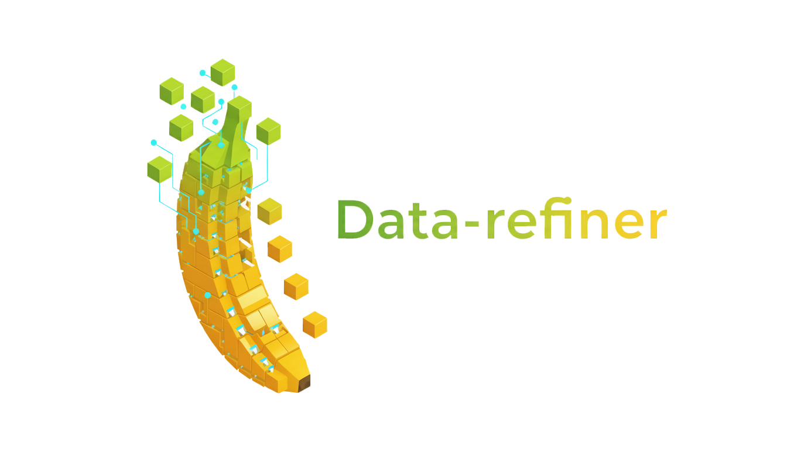

<p align="center">
  
</p>

---

Data-refiner is an extensible data processing framework built on PySpark that enables users to build scalable data pipelines by composing reusable operators. With its built-in Operator Marketplace, users can discover, extend, and combine modular data processing components—like assembling LEGO bricks—to solve complex data tasks without writing complex Spark code.

**Key Features**

- **Composable Pipeline Architecture**

    Workflows are built by assembling modular operators. Pipelines can be reused, extended, swapped, or reconfigured to meet different business needs with minimal effort.

- **Reliable Pipeline Execution**

    Data-refiner provides built-in pipeline validation, execution management, and error handling mechanisms to improve reliability and simplify large-scale data processing.

- **Extensible Operator Ecosystem**

    Data-refiner provides an extensible operator system where users can develop custom operators in Python and share reusable components through the Operator Marketplace.

## Quick Start
Before running, make sure your environment is properly configured to run Apache Spark.

**Install**
```shell
uv pip install data-refiner-pyspark
uv run dr_init && uv run dr_pack_resources
```
**Run**
```python
import data_refiner
from pathlib import Path
from data_refiner import Runner
from pyspark.sql import SparkSession
spark = (
    SparkSession.builder.master("local[1]")
    .appName("data_refiner")
    .enableHiveSupport()
    .getOrCreate()
)
data_path = Path(data_refiner.__file__).parent / "tests/ops/test_data/mapper/html_content_extract_mapper"
pipeline = {
  "read_whole_text_file": {
    "op_name": "whole_text_file_reader",
    "input_path": f"{str(data_path)}",
    "output_df": "input.df",
  },
  "html_content_extract": {
    "op_name": "html_content_extract_mapper",
    "input_df": "input.df",
    "output_df": "html_extract.df",
    "field": "text",
    "output_field": "content",
  },
  "language_identifier": {
    "op_name": "language_identification_mapper",
    "input_df": "html_extract.df",
    "output_df": "language_identification.df",
    "field": "content",
    "output_field": "language",
    "show": {"truncate":True},
  }
}
Runner.from_dict(pipeline).run(spark=spark)
```

## Operator Market
[View the operator market](docs/operator/ops_market.md)

## How to run
- [Run locally](docs/howtouse/run_on_local.md)
- [Run on Cluster](docs/howtouse/run_on_cluster.md)

## Community

---

👉 Join [Discord](https://discord.gg/rmhW2b7UC2) server to:
- Ask questions
- Discuss development
- Share ideas and feedback
- New operator requirements

 OR email to: `sonderbanana@gmail.com`